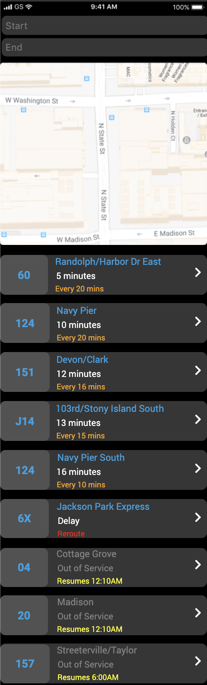

# BusyBus
A public transportation application project designed to apply frontend skills to build bus route views. HTML and CSS were the primary coding languages used to complete this project but Figma was used to design the application.

## Colors
* **Black** - Used as a nuetral color to be easy on the eyes when a user is browsing through the application
* **Blue** - To highlight bus numbers and route names
* **White** - The current time it will take the bus to arrive at a destination
* **Orange** - The amount of time it takes for each bus to arrive at that specific destination
* **Red** - A warning notification to let users know the bus is having issues arriving on time
* **Grey** - Route is not in service

